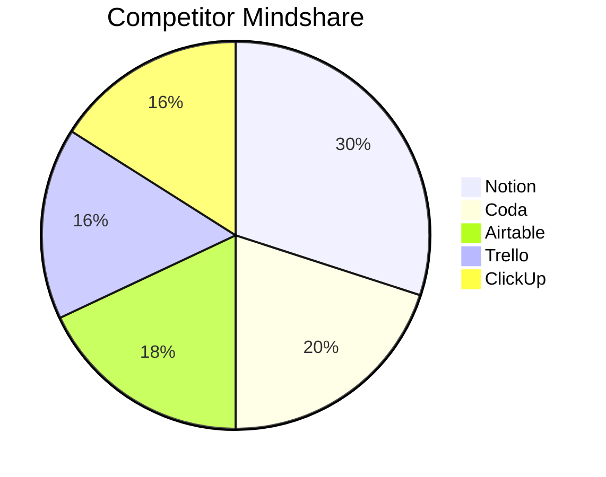
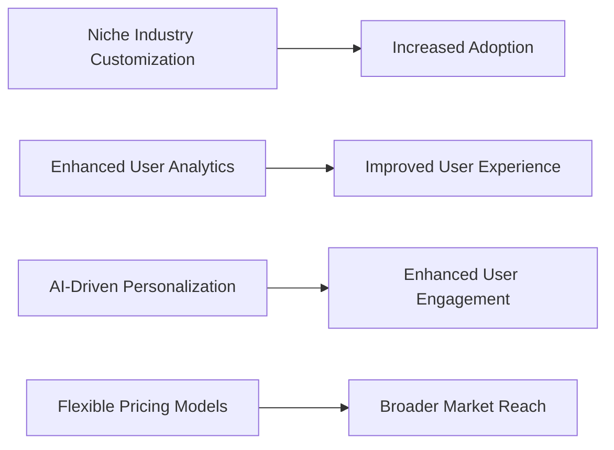
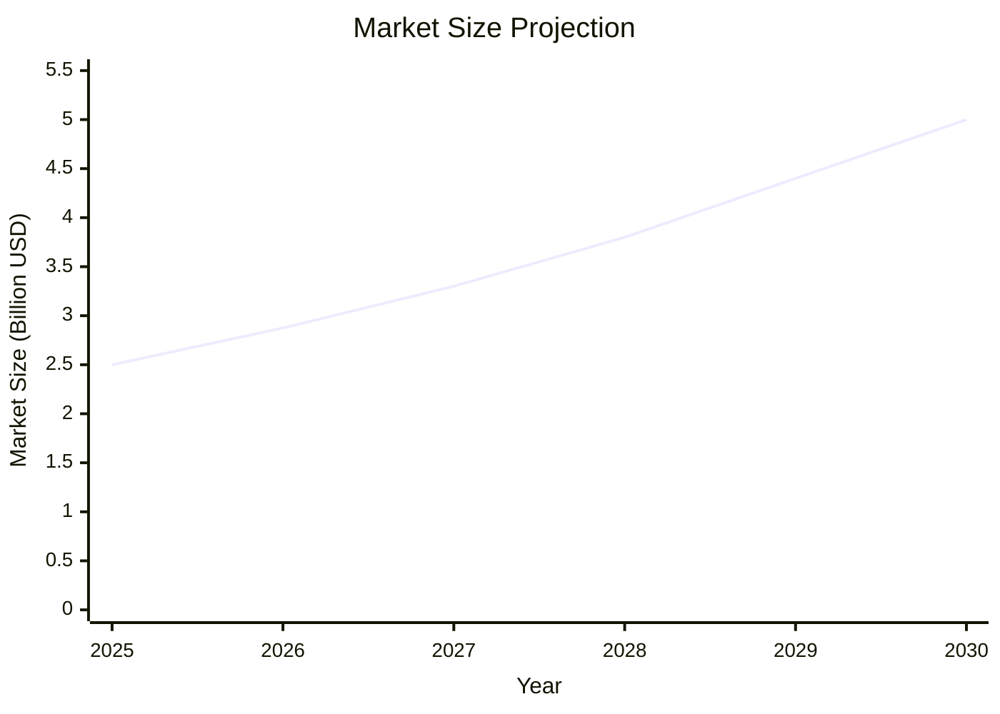
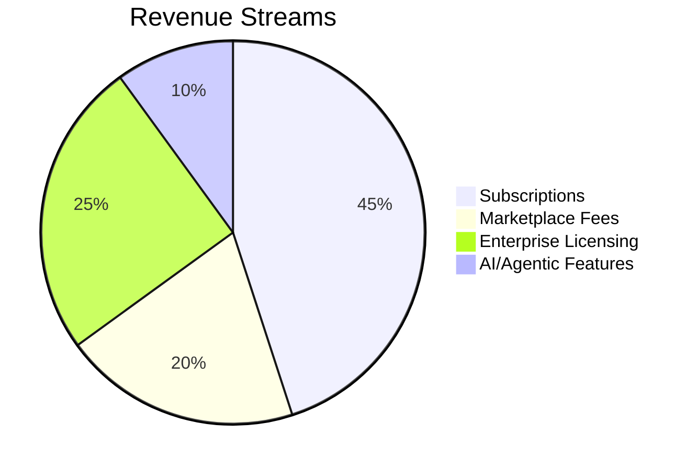
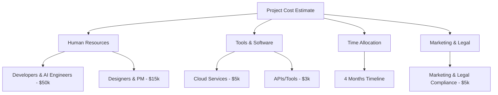

# Market Validation Report: Notion Alternatives with Agentic AI Integration

*Date: May 15, 2025*

---

## Executive Summary

This market validation report evaluates the competitive landscape for Notion alternatives, emphasizing platforms integrating Agentic AI capabilities that can interface with Notion through its MCP server. Through comprehensive competitor analysis, feature and pricing benchmarking, and market projection insights, this report identifies key market gaps and opportunities. 

**Key Findings:**
- The productivity and collaboration tool market is moderately saturated with strong incumbents like Coda, Airtable, Trello, and ClickUp.
- AI integration in task automation, project management, and note-taking remains nascent but highly sought-after.
- Personal Knowledge Management (PKM) combined with advanced collaboration and indexing is underserved.
- Pricing strategies typically follow freemium and tiered models, with room for more flexible, usage-based options.
- The introduction of Agentic AI that autonomously interacts with Notion via MCP server presents a high-value differentiation.

**Recommendations:**
- Develop AI-driven personalization and automation features beyond current offerings.
- Focus on niche industry customization for enhanced adoption.
- Use flexible and transparent pricing models to broaden market reach.
- Leverage advanced user analytics and AI insights to improve user experience and engagement.
- Position the platform as a hybrid between personal knowledge management, project management, and intelligent assistant.

---

## Competitor Analysis

| Competitor       | Core Features                                       | AI Integration             | Pricing Plans                      | Strengths                                     | Weaknesses                                  |
|------------------|----------------------------------------------------|----------------------------|----------------------------------|-----------------------------------------------|---------------------------------------------|
| **Notion**       | All-in-one workspace, databases, templates, sharing| Limited AI capabilities    | Free, Personal $8/mo, Team $15/mo| Highly customizable, strong community         | Limited AI automation, moderate learning curve |
| **Coda**         | Doc-spreadsheet hybrid, templates, automation      | Some AI formulas           | Free, Pro $10/mo, Team $30/mo    | Powerful customization and automation          | Complexity can overwhelm new users           |
| **Airtable**     | Database-spreadsheet, integrations, apps marketplace| Emerging AI automation     | Free, Plus $10/mo, Pro $20/mo    | Strong relational DB features, integrations    | Less focused on note-taking and docs          |
| **Trello**       | Kanban boards, collaboration, integrations          | Minimal AI capabilities    | Free, Business Class $12.50/mo   | Simple visual task management                    | Limited advanced document features            |
| **ClickUp**      | Task management, docs, goals, time tracking          | Basic AI tasks assistance  | Free, Unlimited $9/mo, Business $19/mo | Comprehensive features, competitive pricing | Interface can be overwhelming                 |

### Pricing Comparison Summary

| Plan / Competitor | Notion   | Coda     | Airtable | Trello   | ClickUp  |
|-------------------|----------|----------|----------|----------|----------|
| Free Tier         | ✅        | ✅        | ✅        | ✅        | ✅        |
| Entry Paid Tier/mo | $8       | $10      | $10      | $12.50   | $9       |
| Typical Team Plan/mo | $15     | $30      | $20      | $12.50   | $19      |

---

### Competitor Mindshare Visualization

---

## Unique Selling Points (USPs) Recommendations

Identified USPs to distinguish the new platform in a crowded market:

- **Agentic AI Integration via Notion MCP Server:** Autonomous AI agents capable of performing tasks, data retrieval, and updating Notion workspaces without user micromanagement.
- **Niche Industry Customization:** Tailored templates and workflows for specific industries (e.g., research, legal, education), not widely available in competitors.
- **Advanced User Analytics:** Deep insights into user behavior for data-driven feature adaptations and personalized UI.
- **AI-Driven Personalization:** Adaptive interfaces and content suggestions based on user habits and context.
- **Flexible, Usage-Based Pricing Models:** Innovative pricing that aligns cost with actual usage and value, appealing to both individual and enterprise users.

### USPs Relationship Graph

---

## Market Projection (2025–2030)

The global collaborative workspace and productivity software market is projected to grow robustly driven by remote work trends, digital transformation, and demand for automation.

| Year | Estimated Market Size (Billion USD) | Growth Notes                           |
|-------|------------------------------------|-------------------------------------|
| 2025  | 2.5                                | Growing adoption of collaborative tools |
| 2026  | 2.875                              | Increased AI and automation integrations |
| 2027  | 3.3                                | Expansion into niche vertical markets  |
| 2028  | 3.8                                | More cloud-driven adoption and APIs  |
| 2029  | 4.4                                | Mature user base and multi-tool integrations|
| 2030  | 5.0                                | Widespread AI assistant adoption     |

### Market Size Projection Chart

---

## Revenue Stream Potential

### Identified Revenue Streams

| Revenue Stream         | Description                                        | Estimated Share (1–3 Years) |
|-----------------------|--------------------------------------------------|-----------------------------|
| **Subscriptions**      | Recurring plans (individual, team, enterprise)   | 45%                         |
| **Marketplace Fees**   | Commission from third-party integrations/templates| 20%                         |
| **Enterprise Licensing**| Custom agreements with large organizations        | 25%                         |
| **AI/Agentic Features**| Premium AI capabilities as add-ons                 | 10%                         |

### Revenue Streams Pie Chart

---

## Initial Cost Estimates for MVP Development

| Cost Category        | Description                 | Estimated Cost     |
|---------------------|-----------------------------|-------------------|
| Human Resources     | Developers, AI Engineers, Designers, PM | $65,000           |
| Tools & Software    | Cloud Services, APIs, Development Tools  | $8,000            |
| Time Allocation     | 4 Months Development Timeline             | —                 |
| Marketing & Legal   | Initial outreach, compliance               | $5,000            |

### Estimated Cost Breakdown Flowchart

---

## Conclusion

The market for Notion alternatives is vibrant yet shows clear gaps ripe for innovation—particularly in AI-driven personalization, autonomous Agentic AI agents interfacing directly with Notion MCP servers, and niche industry customization. With a competitive pricing strategy, deep analytics, and flexible modular offerings, the proposed platform can secure a distinct market position. Estimated initial costs are moderate relative to market potential, and the revenue opportunity is particularly strong in subscription and enterprise licensing segments.

Strategic focus on building AI-powered autonomous agents and seamless integrations will unlock substantial adoption and engagement, leveraging emerging AI trends to disrupt existing productivity tools.